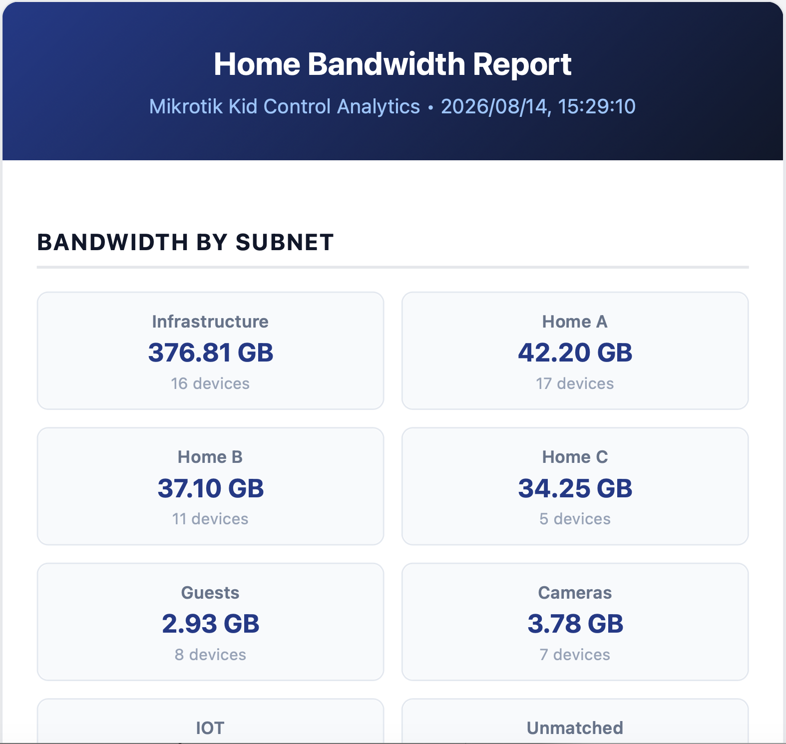
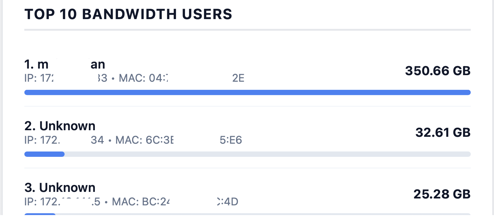

# Mikrotik KidControl Bandwidth Reporter 📊

[](https://opensource.org/licenses/MIT)
[](https://nodejs.org/)
[](https://mikrotik.com/download)

A Node.js service that receives aggregated bandwidth usage reports from Mikrotik routers running RouterOS scripts (such as Kid Control data), groups total consumption by configured subnets/VLANs, highlights top bandwidth consumers, and sends formatted HTML email summaries via SMTP.

---

## ✨ Features

- 📩 **HTTP Webhook Collector**: Accepts batch HTTP POST requests from Mikrotik RouterOS scripts with custom headers (`X-Batch-ID`, `X-Total-Count`).
- ⚡ **Batch Processing & Fallback**: Groups chunked RouterOS payload items into unified reports, with automatic timeouts to handle dropped packet chunks.
- 🌐 **Subnet & VLAN Aggregation**: Categorizes device IPs into user-defined subnets (e.g., *Infrastructure*, *Guests*, *IoT*, *Cameras*) and calculates total MB consumption per subnet.
- 🏆 **Top Usage Tracking & Exclusion Filtering**: Ranks top bandwidth-consuming devices while allowing specific IP subnets to be excluded from top lists.
- 📧 **Beautiful HTML Email Reports**: Sends styled, responsive HTML email summaries with visual bandwidth bars via Nodemailer SMTP.
- 💾 **Local Report Archiving**: Saves generated HTML and JSON data payloads locally to disk (`./data/`).

---

## 📷 Screenshots

| Subnet Bandwidth Report | Top 10 Consumers |
| :---: | :---: |
|  |  |


## 🛠️ Installation & Setup

### Prerequisites

- **Node.js**: v14+ installed on your server or container.
- **Mikrotik Router**: RouterOS device with Kid Control or custom accounting scripts enabled.

### 1. Clone & Install Dependencies

```bash
git clone https://github.com/seanco1/mikrotik-reporter.git
cd mikrotik-reporter
npm install
```

### 2. Configuration

Create your configuration file from the example template:

```bash
cp config.json.example config.json
```

Edit `config.json` with your server settings, subnets, and SMTP server details:

```json
{
  "port": 5000,
  "batchTimeoutMs": 10000,
  "smtp": {
    "host": "smtp.gmail.com",
    "port": 587,
    "secure": false,
    "user": "your-email@gmail.com",
    "pass": "your-app-password",
    "from": "your-email@gmail.com",
    "to": "recipient@example.com"
  },
  "subnets": [
    { "name": "Infrastructure", "cidr": "172.18.141.0/24" },
    { "name": "Home Devices", "cidr": "172.18.139.0/24" },
    { "name": "Guests", "cidr": "172.31.40.0/24" },
    { "name": "IoT", "cidr": "172.18.143.0/24" }
  ],
  "excludeFromTop10": [
    "172.18.141.0/24"
  ]
}
```

---

## 🚀 Running the Service

### Direct Execution

```bash
npm start
```

### Running in Background with PM2

```bash
npm install -g pm2
pm2 start server.js --name "mikrotik-reporter"
pm2 save
```

---

## 📡 API Endpoints & Usage

### 1. Webhook Endpoint (`POST /webhook`)

Mikrotik RouterOS sends batch items via JSON HTTP POST.

**Required Headers:**
- `X-Batch-ID`: Unique string identifier for the batch report execution (e.g., `batch-1700000000`).
- `X-Total-Count`: Total number of chunked HTTP requests expected in this batch.

**Sample Request Body (sent per device by Mikrotik):**
```json
{
  "name": "John-Laptop",
  "mac": "AA:BB:CC:DD:EE:FF",
  "ips": "172.18.139.45",
  "total_mb": 1540.5
}
```

### 2. Status & Health Check (`GET /status`)

Inspect active processing batches and archived report counts:

```bash
curl http://localhost:5000/status
```

---

## 🤖 RouterOS Integration Example ("Report" Script)

Add the following RouterOS script (e.g., named `Report`) on your Mikrotik router (tested on RouterOS v7) and run it via `/system scheduler` periodically:

```routeros
# 1. Dynamically find only devices with active traffic
:local activeDevices [/ip/kid-control/device find where bytes-down>0 or bytes-up>0]
:local totalCount [:len $activeDevices]

# 2. If no devices have traffic log it and stop
:if ($totalCount = 0) do={
    :log info "Kid-control report skipped: No devices have active data usage."
    :error "Stopping script: No active devices found."
}

# 3. Create a unique Batch ID
:local systemTime [/system/clock/get time]
:local systemDate [/system/clock/get date]
:local batchId ($systemDate . "-" . $systemTime)

:log info "Starting kid-control data streaming. Streaming active items."

# 4. Iterate through active devices
:foreach i in=$activeDevices do={
    :local mac [/ip/kid-control/device get $i mac-address]
    :local name [/ip/kid-control/device get $i name]
    :local devIPs [/ip/kid-control/device get $i ip-address]
    
    # Standardize empty names
    :if ([:len $name] = 0) do={ :set name "Unknown" }
    
    # Convert raw bytes safely to Megabytes
    :local downBytes [/ip/kid-control/device get $i bytes-down]
    :local upBytes [/ip/kid-control/device get $i bytes-up]
    :local totalMB (($downBytes / 1048576) + ($upBytes / 1048576))
    
    # Process multiple IPs into a semicolon string (IPv4 only)
    :local ipString ""
    :foreach ip in=$devIPs do={
        :local ipStr [:tostr $ip]
        :if ([:typeof [:find $ipStr ":"]] = "nil") do={
            :if ([:len $ipString] = 0) do={ :set ipString $ipStr } else={ :set ipString ($ipString . ";" . $ipStr) }
        }
    }
    :if ([:len $ipString] = 0) do={ :set ipString "no-ip" }

    # Generate JSON payload for single device
    :local singlePayload "{\"name\":\"$name\",\"mac\":\"$mac\",\"ips\":\"$ipString\",\"total_mb\":\"$totalMB\"}"
    
    # Define custom headers for RouterOS v7
    :local httpHeaders "X-Batch-ID:$batchId,X-Total-Count:$totalCount,Content-Type:application/json"

    # POST directly to mikrotik-reporter webhook (adjust server IP / port)
    /tool fetch url="http://YOUR_SERVER_IP:5000/webhook" http-method=post http-data=$singlePayload http-header-field=$httpHeaders keep-result=no;
    
    :delay 100ms
}

:log info "All active kid-control data entries streamed successfully."
```

---


## 📄 License

[MIT](LICENSE) - Free to use and modify!
